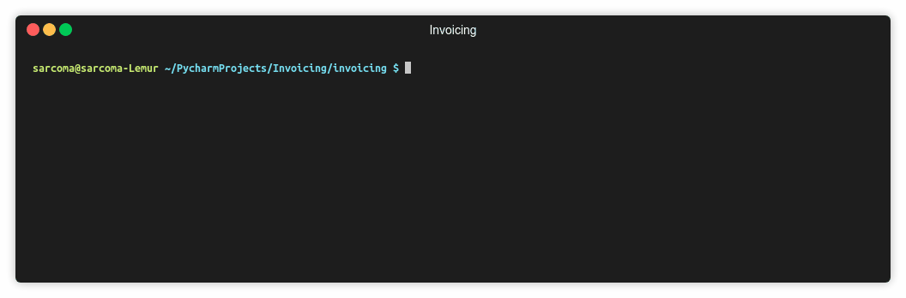

# Invoicing

Console script for producing quotes and invoices from a LaTeX template

## Getting Started

Copy .env.example and rename to .env

`cp invoicing/.env.example invoicing/.env`

Copy the example LaTeX invoices

`cp invoicing/templates/Invoice.example.tex invoicing/templates/Invoice.tex`

`cp invoicing/templates/Quote.example.tex invoicing/templates/Quote.tex`

Use `poetry` to install dependencies

`poetry install`

cd into `cd ./invoicing` and run `python command_line.py` to begin
